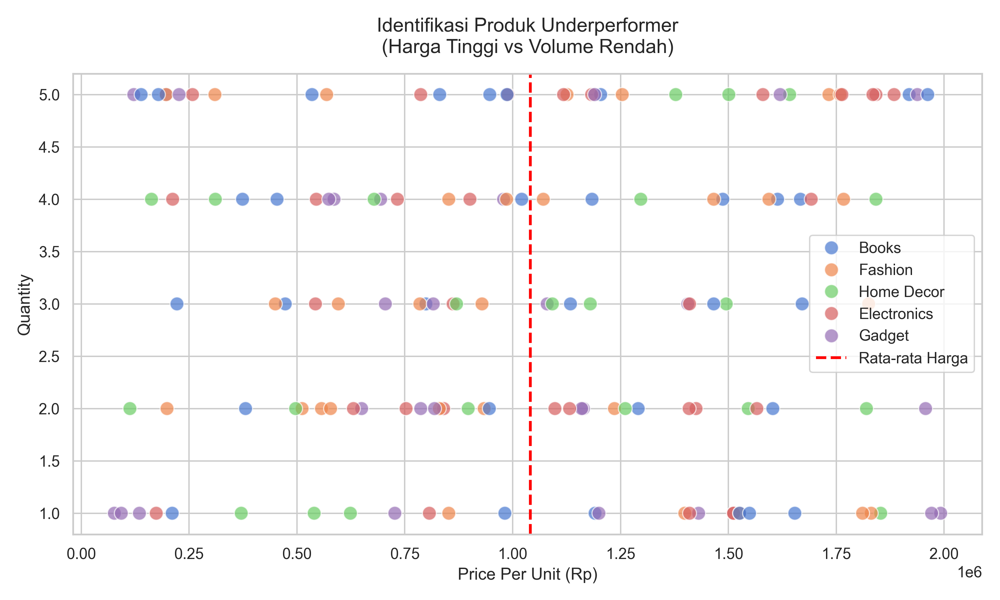
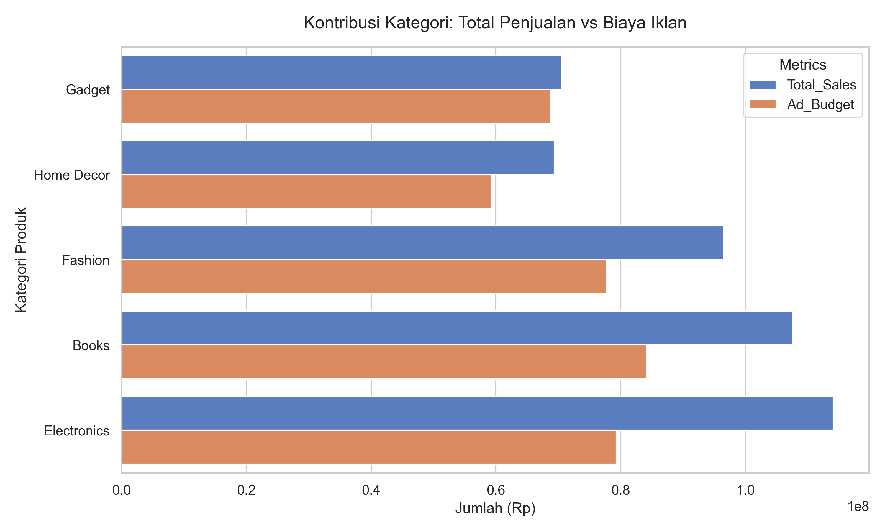
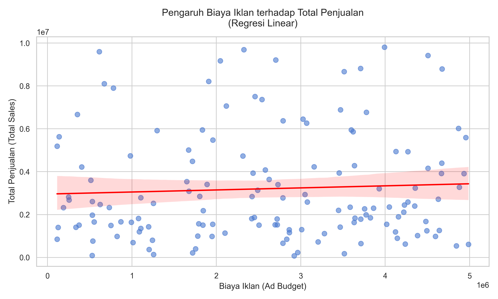

# Laporan Praktikum Analisis Performa Penjualan E-commerce

## 1. Business Question
- Siapa pelanggan terbaik kita yang berhak mendapatkan program loyalitas?
- Produk dan kategori mana yang memiliki kinerja kurang memuaskan (*underperformer*) dan mana yang paling efisien terhadap anggaran iklan?
- Apakah peningkatan anggaran iklan (`Ad_Budget`) benar-benar menghasilkan peningkatan penjualan (`Total_Sales`) yang signifikan?

## 2. Data Wrangling
Proses pembersihan data yang dilakukan pada dataset awal (`data_praktikum_analisis_data.csv`):
- **Bentuk awal data**: 150 baris dan 8 kolom.
- **Pembersihan Data Kosong**: Menghapus baris yang memiliki nilai kosong (`NaN`) pada kolom `Total_Sales` karena merupakan variabel target utama.
- **Pembersihan Anomali**: Memastikan tidak ada produk dengan nilai `Price_Per_Unit` negatif.
- **Konversi Tipe Data**: Mengubah kolom `Order_Date` menjadi tipe `datetime` untuk memudahkan analisis *Recency* (RFM).
- **Hasil Akhir**: Tersisa 143 baris data yang bersih dan siap dianalisis.

## 3. Insights
Berikut adalah *insights* yang didapatkan dari analisis dan visualisasi data:

### A. Identifikasi Underperformer (Harga Tinggi, Volume Rendah)
Berdasarkan scatter plot, rata-rata harga produk (`Price_Per_Unit`) adalah **Rp 1.040.643**. Terdapat beberapa produk di kuadran kanan bawah (harga jauh di atas rata-rata, namun *Quantity* penjualannya sangat rendah, misalnya hanya laku 1 atau 2 unit). Produk ini menjadi beban arus kas.

### B. Segmentasi Pelanggan (RFM Analysis)
Telah dilakukan *RFM Analysis* terhadap pelanggan. Contoh pelanggan terbaik kita (RFM Group: **523**) yang baru-baru ini berbelanja (Recency kecil/skor 5) dan menyumbang *Monetary* yang cukup baik. Pelanggan dikelompokkan ke skor 1-5 untuk masing-masing pilar. Daftar lengkap RFM bisa dilihat pada `hasil_rfm.csv`.

### C. Analisis Kontribusi Kategori (Efisiensi Iklan)
Berdasarkan rasio *Efficiency Ratio* (`Total_Sales` / `Ad_Budget`), berikut adalah urutan efisiensinya:
1. **Electronics**: Paling efisien (Rasio 1.439)
2. **Books**: Efisien (Rasio 1.277)
3. **Fashion**: Cukup efisien (Rasio 1.241)
4. **Home Decor**: Kurang efisien (Rasio 1.170)
5. **Gadget**: Paling tidak efisien (Rasio 1.025)

Kategori **Gadget** menghabiskan anggaran iklan besar namun penjualannya tidak sebanding.

### D. Uji Hipotesis & Regresi Linear
Dari pengujian hipotesis sederhana menggunakan nilai median Ad_Budget (**Rp 2.703.000**):
- Rata-rata total penjualan saat iklan **Rendah**: Rp 3.291.306
- Rata-rata total penjualan saat iklan **Tinggi**: Rp 3.114.127

Secara mengejutkan, anggaran iklan yang tinggi **tidak menjamin** peningkatan rata-rata *Total Sales*. Hal ini dikonfirmasi oleh model Regresi Linear:
- **Koefisien Slope**: 0.10 (Kenaikan 1 unit Ad Budget hanya menambah 0.10 unit Total Sales)
- **Akurasi Model ($R^2$)**: 0.0030 (Sangat rendah, artinya Ad Budget bukan faktor utama penentu Total Sales)

## 4. Recommendation
Berdasarkan *insights* di atas, rekomendasi strategi bisnis untuk perusahaan adalah:
1. **Evaluasi Ulang Anggaran Iklan**: Hentikan *bakar uang* untuk iklan secara membabi buta. Data membuktikan peningkatan iklan tidak linier dengan peningkatan penjualan.
2. **Realokasi Anggaran ke "Electronics"**: Kategori *Gadget* sangat tidak efisien. Pangkas sebagian anggaran iklan *Gadget* dan realokasikan ke kategori *Electronics* yang terbukti memiliki rasio konversi (*Efficiency Ratio*) paling tinggi.
3. **Penyesuaian Harga "Underperformer"**: Lakukan diskon strategis atau strategi *bundling* untuk produk-produk dengan harga di atas Rp 1.500.000 yang saat ini memiliki tingkat konversi (Volume) sangat rendah, guna mencairkan *dead stock*.
4. **Program Loyalitas Berbasis RFM**: Berikan voucher atau *early access* kepada pelanggan dengan skor `R_Score` tinggi (baru saja belanja) dan `M_Score` tinggi untuk mempertahankan retensi mereka.
